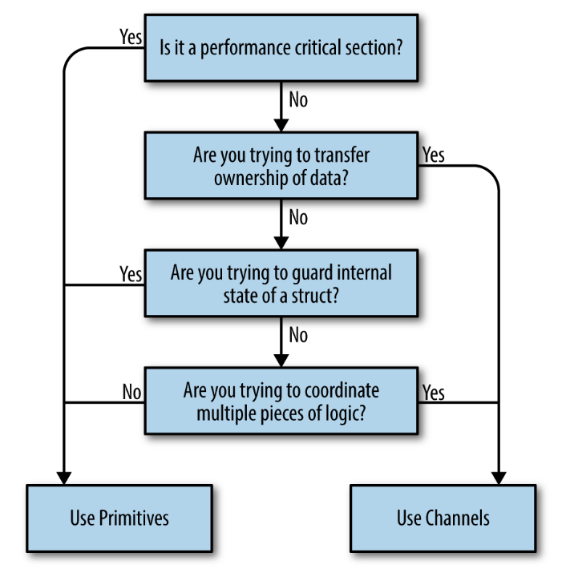
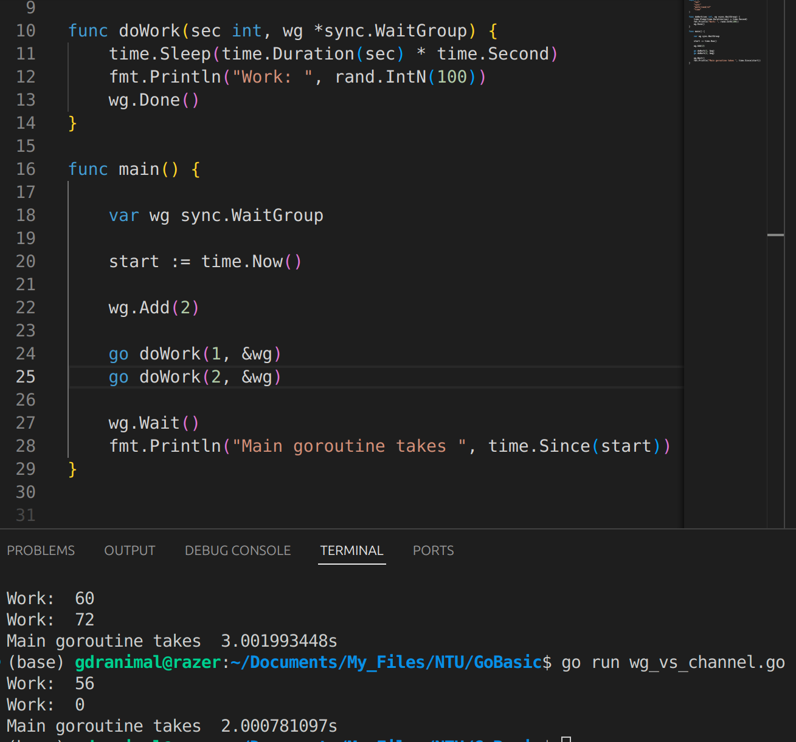
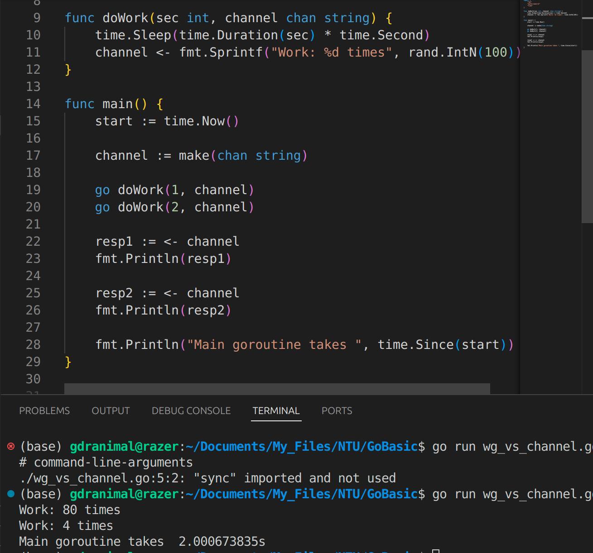
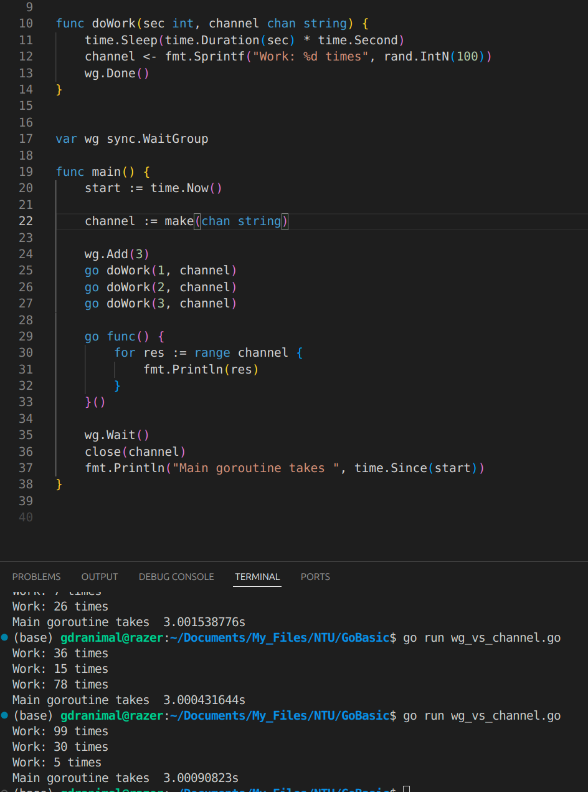
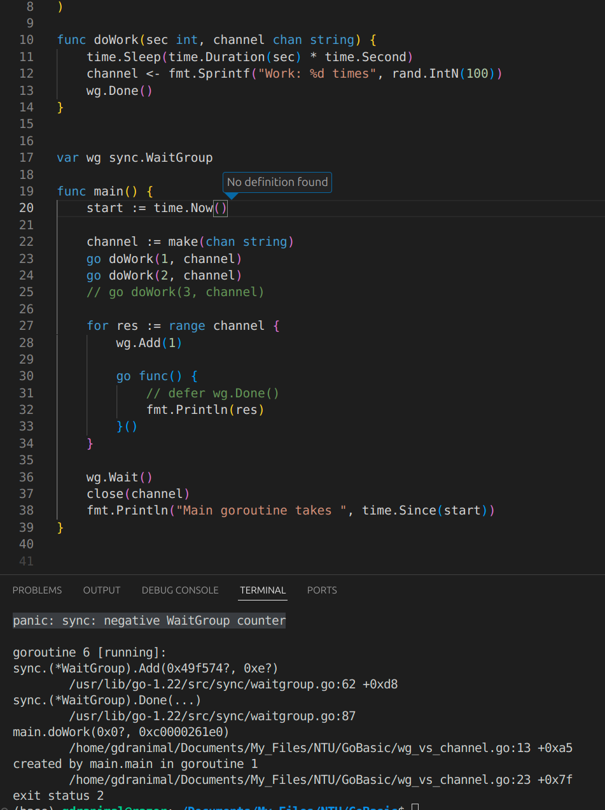
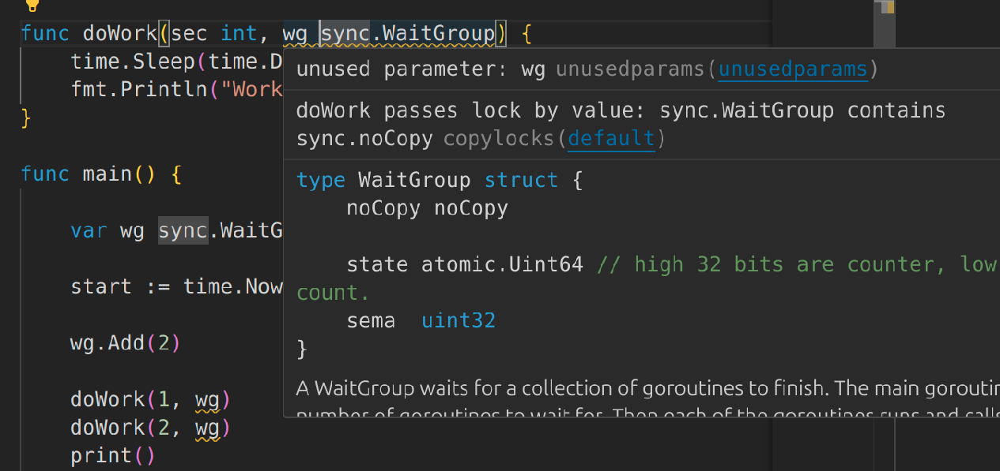
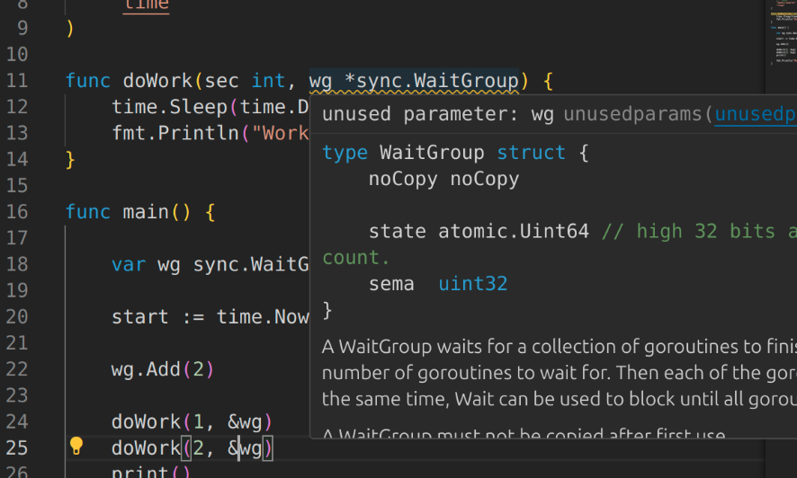

# Concurrency in Go
### Concepts from Communicating Sequential Processes (CSP), channels and select statements, add value as well
- M:N scheduler, which means it maps M green threads to N OS threads.
> When we have more goroutines than green threads available, Go's runtime distributes the goroutines to new OS thread

- Goroutine is like Thread, but more effiecient thanks to Go's Runtime
> - Many goroutine can be multiplexed on fewer OS's threads m:n where 
m = Goroutines ; n = threads

- TLDR: 1 Goroutine combines concurrency and parallel by Go's runtime, so 1 Goroutine may NOT = 1 Thread, but behave like it. 
>  In Go,we would create a goroutine for each incoming connection, and then return from the goroutine’s function

## Chapter 3
> A goroutine is a function that is running concurrently

### Fork-join model 
   - Fork: split child branch from parent 
   - Join: Merge child branch with parent

Example
```
sayHello := func() {
   fmt.Println("hello")
}

go sayHello()
```
- Problem:
   - ```main()``` will be executed finished before ```sayHello()``` can run
- Solution:
   - Method 1: Add a time.sleep() after ```go sayHello()```, but it doesn't create join point, only race condition?
   - Method 2: Create a join point by synchronize the main goroutine and ```sayHello()``` goroutine using ```sync.WaitGroup```

### WaitGroup in for loop
```
var wg sync.WaitGroup
for _, salutation := range[]string{"hello", "greetings", "good day"} {
	wg.Add(1)
	go func(salutation string) {
      defer wg.Done()
      fmt.Println(salutation)
   }(salutation)
}
wg.Wait()
```
- We pass the parameter to the closure, a copy of string is made ensure goroutine refers to correct string
- Output
```
good day
hello
greetings
```
### Measure the amount of memory allocated before and after goroutine creation
Page 44-46
### When to use Wait Group vs Channel

- Primative (Wait Group) Page 47-48
   - Use for synchronization, allow 1 goroutine to wait for group of other goroutine to complete tasks.
- Channel (Page 64-78)
   - for communication btw goroutine, allow goroutine send and receive data, acts as Pipeline
   - What is ```Pipeline``` (Page 100-113)
- When to use Wait Group or Channel?
   - Wait Group 
      - Parameters: 
         - Add(no. workers)
            - ```Add(3)``` = 3 Workers  
         - Done()
            - is called same as No. Workers
            - ```Done()``` called 3 times
         - Wait() 
            - This will be called after ```Done()``` is called 3 times
      - Without data transfer, no communication among goroutines
      - Example:
       
   - Channel:
      - Parameter: ```select``` statement
      - Produce data that shared among goroutines (aka Transfer ownership)
      - Cleaner code with ```select``` statement when coordinate diff. goroutines
      - Example:
         - Simple 
      
         - For loop (Required ```Wait Group```)
         
   - Errors & Warnings: 
      - ```panic: sync: negative WaitGroup counter```
       
      - Warning: Pass by value
      
      - No more Warning
        
   
   
### Mutex and RWMutex
Page 49-52
### Cond
Page 52-57
### Once
Page 58-59
### Pool
Page 59-64
### Select statement
Page 78-82
## Chapter 4
### Confinement
Page 85-88
### For-select Loop
Page 89-90
### Prevent Goroutine Leak
Page 90-94
### The or-channel
Page 94-96
### Error handling
Page 97-100
### Fan in, Fan out
Page 114-119
### Or-done-channel
Page 119-120
### Tee-channel
Page 120-121
### Bridge channel
Page 121-123
### Queuing
Page 124-130
### Context manager
Page 131-145
